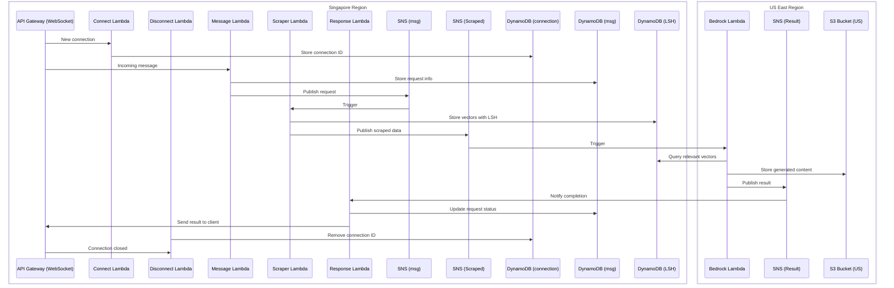

```mermaid
sequenceDiagram
    box Singapore Region
    participant APIGateway as API Gateway (WebSocket)
    participant ConnectLambda as Connect Lambda
    participant DisconnectLambda as Disconnect Lambda
    participant MessageLambda as Message Lambda
    participant ScraperLambda as Scraper Lambda
    participant ResponseLambda as Response Lambda
    participant SNS_message as SNS (msg)
    participant SNS_Scraped as SNS (Scraped)
    participant DDB_connection as DynamoDB (connection)
    participant DDB_message as DynamoDB (msg)
    participant DDB_vector as DynamoDB (LSH)
    end

    box US East Region
    participant BedrockLambda as Bedrock Lambda
    participant SNS_Result as SNS (Result)
    participant S3_US as S3 Bucket (US)

    end

    APIGateway->>ConnectLambda: New connection
    ConnectLambda->>DDB_connection: Store connection ID
    APIGateway->>MessageLambda: Incoming message
    MessageLambda->>DDB_message: Store request info
    MessageLambda->>SNS_message: Publish request
    SNS_message->>ScraperLambda: Trigger
    ScraperLambda->>DDB_vector: Store vectors with LSH
    ScraperLambda->>SNS_Scraped: Publish scraped data

    SNS_Scraped->>BedrockLambda: Trigger
    BedrockLambda->>DDB_vector: Query relevant vectors
    BedrockLambda->>S3_US: Store generated content
    BedrockLambda->>SNS_Result: Publish result
    SNS_Result->>ResponseLambda: Notify completion
    ResponseLambda->>DDB_message: Update request status
    ResponseLambda->>APIGateway: Send result to client

    DisconnectLambda->>DDB_connection: Remove connection ID
    APIGateway->>DisconnectLambda: Connection closed

```