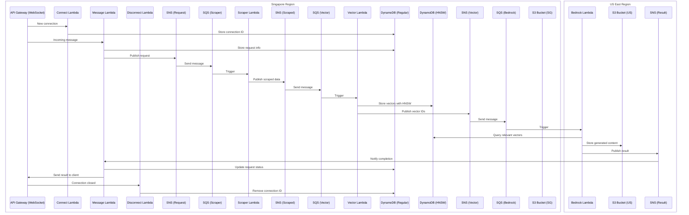

```mermaid
sequenceDiagram
    box Singapore Region
    participant APIGateway as API Gateway (WebSocket)
    participant ConnectLambda as Connect Lambda
    participant MessageLambda as Message Lambda
    participant DisconnectLambda as Disconnect Lambda
    participant SNS_Request as SNS (Request)
    participant SQS_Scraper as SQS (Scraper)
    participant ScraperLambda as Scraper Lambda
    participant SNS_Scraped as SNS (Scraped)
    participant SQS_Vector as SQS (Vector)
    participant VectorLambda as Vector Lambda
    participant DynamoDB as DynamoDB (Regular)
    participant VectorDB as DynamoDB (HNSW)
    participant SNS_Vector as SNS (Vector)
    participant SQS_Bedrock as SQS (Bedrock)
    participant S3_SG as S3 Bucket (SG)
    end

    box US East Region
    participant BedrockLambda as Bedrock Lambda
    participant S3_US as S3 Bucket (US)
    participant SNS_Result as SNS (Result)
    end

    APIGateway->>ConnectLambda: New connection
    ConnectLambda->>DynamoDB: Store connection ID
    APIGateway->>MessageLambda: Incoming message
    MessageLambda->>DynamoDB: Store request info
    MessageLambda->>SNS_Request: Publish request
    SNS_Request->>SQS_Scraper: Send message
    SQS_Scraper->>ScraperLambda: Trigger
    ScraperLambda->>SNS_Scraped: Publish scraped data
    SNS_Scraped->>SQS_Vector: Send message
    SQS_Vector->>VectorLambda: Trigger
    VectorLambda->>VectorDB: Store vectors with HNSW
    VectorLambda->>SNS_Vector: Publish vector IDs
    SNS_Vector->>SQS_Bedrock: Send message
    SQS_Bedrock->>BedrockLambda: Trigger
    BedrockLambda->>VectorDB: Query relevant vectors
    BedrockLambda->>S3_US: Store generated content
    BedrockLambda->>SNS_Result: Publish result
    SNS_Result->>MessageLambda: Notify completion
    MessageLambda->>DynamoDB: Update request status
    MessageLambda->>APIGateway: Send result to client
    APIGateway->>DisconnectLambda: Connection closed
    DisconnectLambda->>DynamoDB: Remove connection ID

```