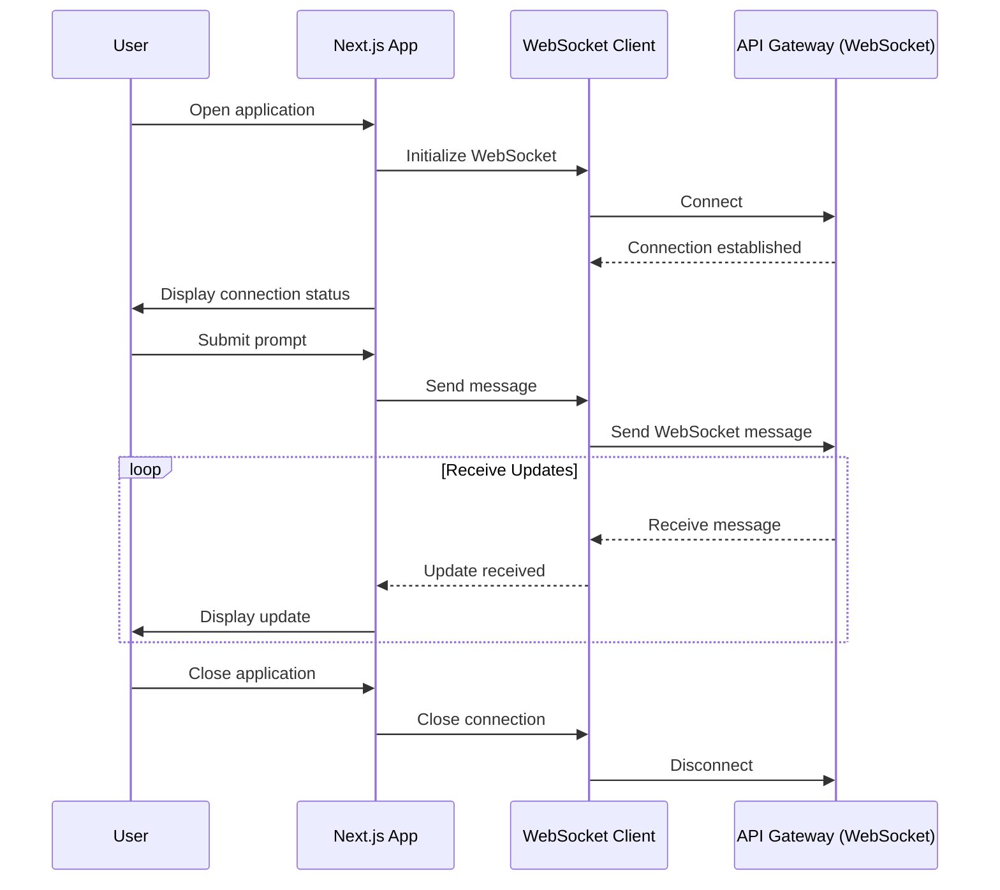

```mermaid
sequenceDiagram
    participant User
    participant NextJS as Next.js App
    participant WebSocket as WebSocket Client
    participant APIGateway as API Gateway (WebSocket)

    User->>NextJS: Open application
    NextJS->>WebSocket: Initialize WebSocket
    WebSocket->>APIGateway: Connect
    APIGateway-->>WebSocket: Connection established
    NextJS->>User: Display connection status

    User->>NextJS: Submit prompt
    NextJS->>WebSocket: Send message
    WebSocket->>APIGateway: Send WebSocket message
    
    loop Receive Updates
        APIGateway-->>WebSocket: Receive message
        WebSocket-->>NextJS: Update received
        NextJS->>User: Display update
    end

    User->>NextJS: Close application
    NextJS->>WebSocket: Close connection
    WebSocket->>APIGateway: Disconnect
```
